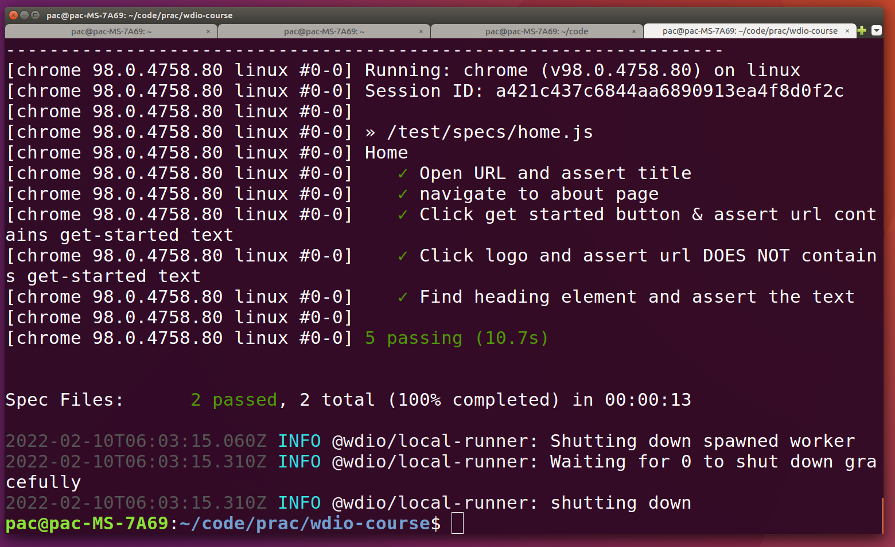

# Summary
* My git repo. for coding along with udemy webdriverio-complete-beginner-course by Dilpreet Johal.
* It used WebdriverIO to navigates to different parts of https://practice.automationbro.com/ and does various automated tests.

## Usage
1. install npm version 16
2. ```git clone git@github.com:sunpochin/wdio-course.git```
3. ```npx wdio```
  
