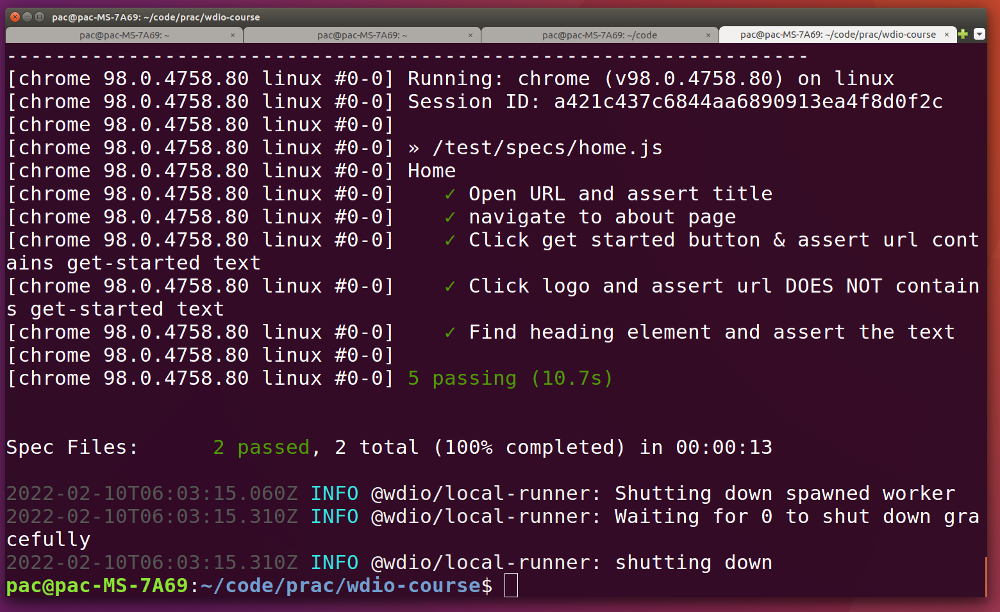

# Summary
* My git repo. for coding along with udemy webdriverio appium courses.

## Usage
1. install npm version 16
2. ```git clone git@github.com:sunpochin/wdio-course.git```
3. ```cd wdio-appium``` or ```cd wdio-web```
4. ```npx wdio```
4. The execution result should be like:
  
